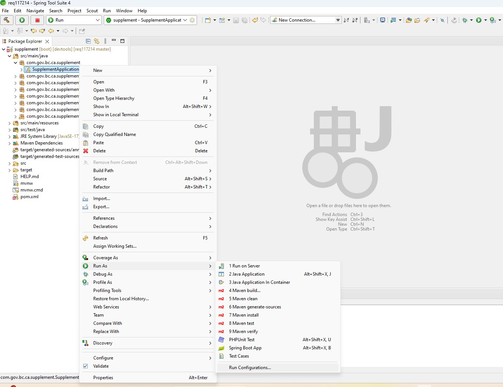
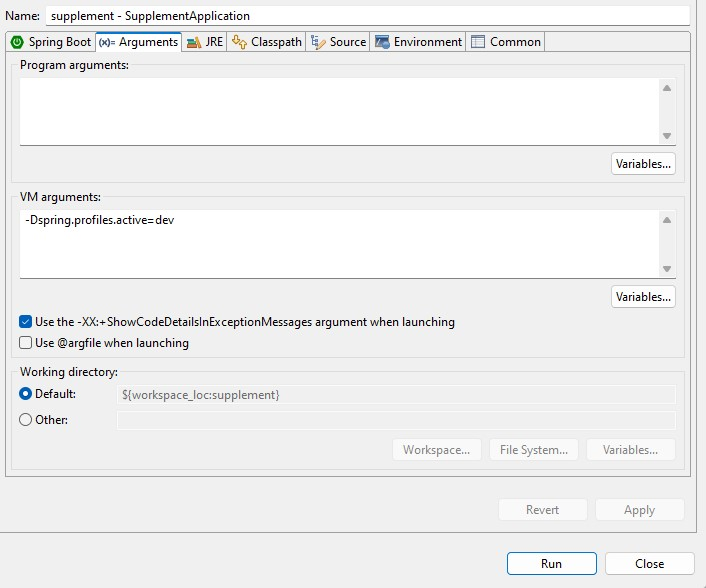
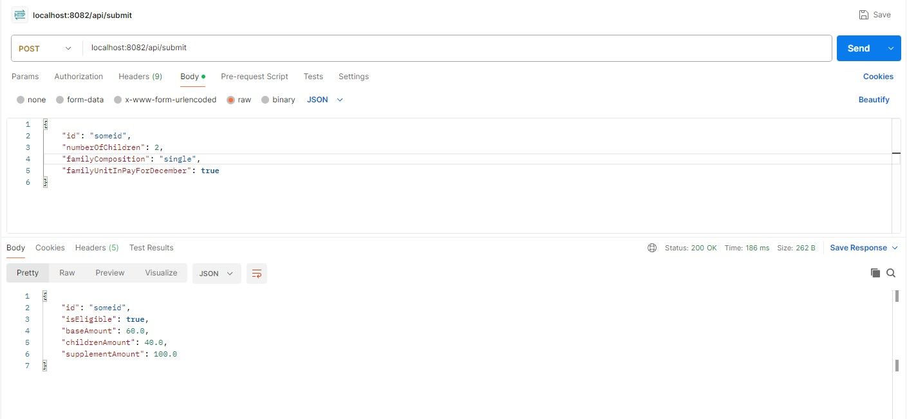
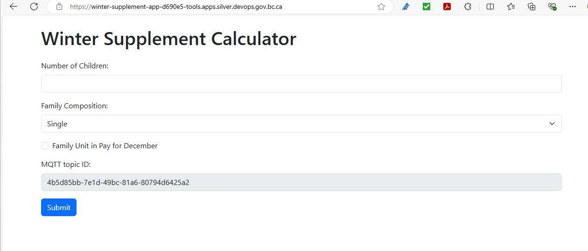
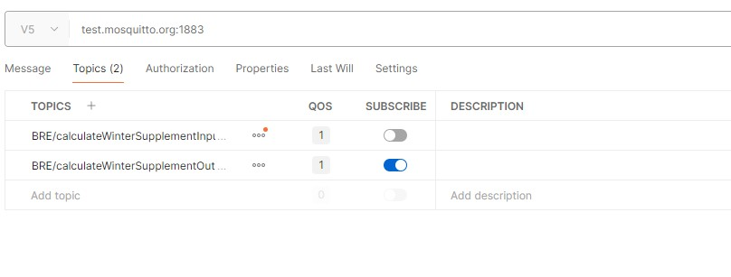
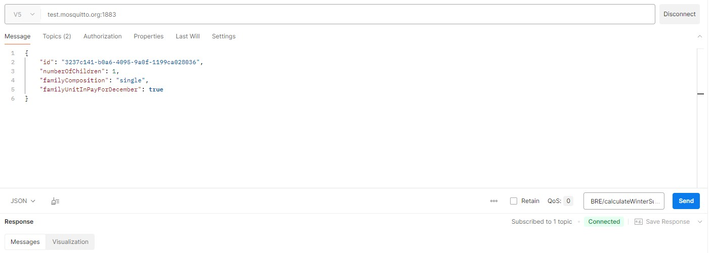
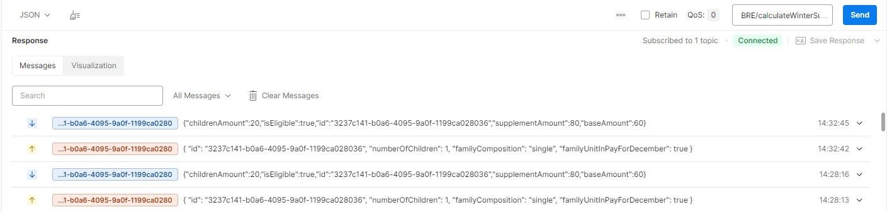

# REQ117214
# Name: Ho Yin Dominic Leung

 
 

# Introduction

This assignment involves creating a rules engine to work with the existing Winter Supplement Calculator to calculate the total supplement amount on December base on applicant's eligibility.  The rules engine is developed as a Java Spring Boot application.  It accepts POST requests (i.e: `/api/submit`) with the following as an example:

*Request:*
{
  "id": "abcde",
  "numberOfChildren: 1,
  "familyComposition": "single",
  "familyUnitInPayForDecember": true
}

*Response:*
{
  "id": "abcde",
  "isEligible": true,
  "baseAmount": 60.0,
  "childrenAmount": 20.0,
  "supplementAmount": 80.0
}

This README file outlines the setup of the local development environment and how to conduct different tests.

 
 

# Local Development Environment Setup

## 1. Download the repository

Download the source repository using the following `git clone` command:
`git clone https://github.com/ldominic-hy/req117214.git`

## 2. Configure the application

The application is located inside the `supplement` folder.  There are two profiles, `dev` and `cert`, created in the `supplement\src\main\resources` folder.  The `dev` profile serves as the local development environment configuration, while the `cert` profile serves as the server testing environment configuration.  The following is a list of configurable parameters:

1. `mqttsvr.url`: The url of the MQTT Broker
2. `mqttsvr.port`: The port number of the MQTT Broker
3. `mqttsvr.timeout`: The message timeout period
4. `mqttsvr.topicId`: The topic id from the winter supplement web app
5. `mqttsvr.inboundTopic`: The inbound topic url for the MQTT Broker
6. `mqttsvr.outboundTopic`: The outbound topic url for the MQTT Broker
7. `port`: The port number to access the API (i.e: http://localhost:{`port`})

Note that the full inbound topic and outbound topic are made up by the following components:
`mqttsvr.inboundTopic` + '/' + `mqttsvr.topicId`
`mqttsvr.outboundTopic` + '/' + `mqttsvr.topicId`

## 3. Build, run the unit tests, and start the application from the command line

1. From the `supplement` folder, trigger a full build and run all the unit tests using Maven command:
`mvn clean build`

2. Start the application with the following command line:
`mvn spring-boot:run -Dspring-boot.run.profiles=dev`

## 4. Start the application using IDE tools (Spring Tool Suite)

1. From `com.gov.bc.ca.supplement.SupplementApplication.java`, right-click and select `Run As`, then select `Run Configurations...`

2. Select the `(x)= Arguments` tab.  In the `VM arguments:` section, add `-Dspring.profiles.active=dev`.  `dev` is an existing configuration profile and can be changed to any other profile (e.g: `cert`)

3. Click the `Run` button to start the application

 
 

# Local Environment Testing

Application testing can be divided into specific rules engine testing and integration testing with the UI and MQTT Broker.

## 1. Application rules engine testing with JUnit

JUnit test cases are included in this assignment to cover different input scenarios based on the number of children, family composition, and family unit in pay for December.  The JUnit tests can be triggered in a command prompt using the Maven command `mvn clean build` from the `supplement` folder.

## 2. Application rules engine testing with Postman

Postman is a selected tool used for testing the rules engine.  Assuming the port number has been configured as 8082 in the application-dev.yml, the POST request can be tested by following the screenshot below:

1. Create a new POST request using the URL `localhost:8082/api/submit`
2. From the `Body` tab, create a `raw` JSON input similar to the one above
3. Click the `Send` button
4. The API response is displayed at the bottom of the screen

## 3. Integration testing with the Winter Supplement Calculator

1. Open the Winter Supplement Calculator application from the URL `https://winter-supplement-app-d690e5-tools.apps.silver.devops.gov.bc.ca`

2. Copy the `MQTT topic ID` value from the application
3. From the `application-dev.yml` file in the `supplement\src\main\resources` folder, replace the `mqttsvr.topicId` value with this new value
4. Restart the application to begin testing

## 4. Integration testing with Postman (** Winter Supplement Calculator not working **)

The local integration testing for this assignment used Postman because the Winter Supplement Calculator was unable to send the request message to the MQTT inbound topic.  The testing with Postman aimed to simulate the Winter Supplement Calculator scenario as follows:

1. Setup the subscribe and publish topics in the reverse order from the `Topics` tab as follows:

&nbsp;&nbsp;&nbsp;&nbsp;&nbsp;&nbsp;&nbsp;*Publish topic:* `BRE/calculateWinterSupplementInput/3237c141-b0a6-4095-9a0f-1199ca028036`

&nbsp;&nbsp;&nbsp;&nbsp;&nbsp;&nbsp;&nbsp;*Subscribe topic:* `BRE/calculateWinterSupplementOutput/3237c141-b0a6-4095-9a0f-1199ca028036`

2. In the `application-dev.yml` file, update the `mqttsvr.topicId` value to `3237c141-b0a6-4095-9a0f-1199ca028036`

3. From the `Message` tab in Postman, create the request JSON that simulates the input from the Winter Supplement Calculator.  Select `JSON` as the message type and input the publish topic into the text field.  Click the `Send` button

4. The `Response` section displays that the published topic receives the inbound JSON and then the results from the rules engine are sent to the subscribed topic correctly

